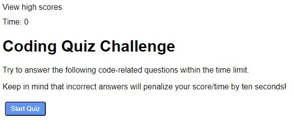
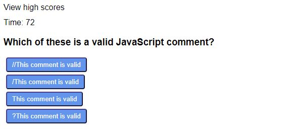

# 04-Web-APIs-code-quiz

The task is to create a timed quiz on JavaScript fundamentals that stores high scores of the participants. 

## Screenshots
  

## Acceptance Criteria

GIVEN I am taking a code quiz
WHEN I click the start button
THEN a timer starts and I am presented with a question
WHEN I answer a question
THEN I am presented with another question
WHEN I answer a question incorrectly
THEN time is subtracted from the clock
WHEN all questions are answered or the timer reaches 0
THEN the game is over
WHEN the game is over
THEN I can save my initials and score

## Special Challenges
- identifying the right or wrong answers in a function
- subtracting time from timer for wrong answers
- moving to next question on the click of any answer button in the previous question
- displaying the "right" or "wrong" confirmation after answering a question

## Links
- [Deployment Link](https://henniepenny.github.io/04-Web-APIs-code-quiz/)
- [Repository Link](https://github.com/HenniePenny/04-Web-APIs-code-quiz)